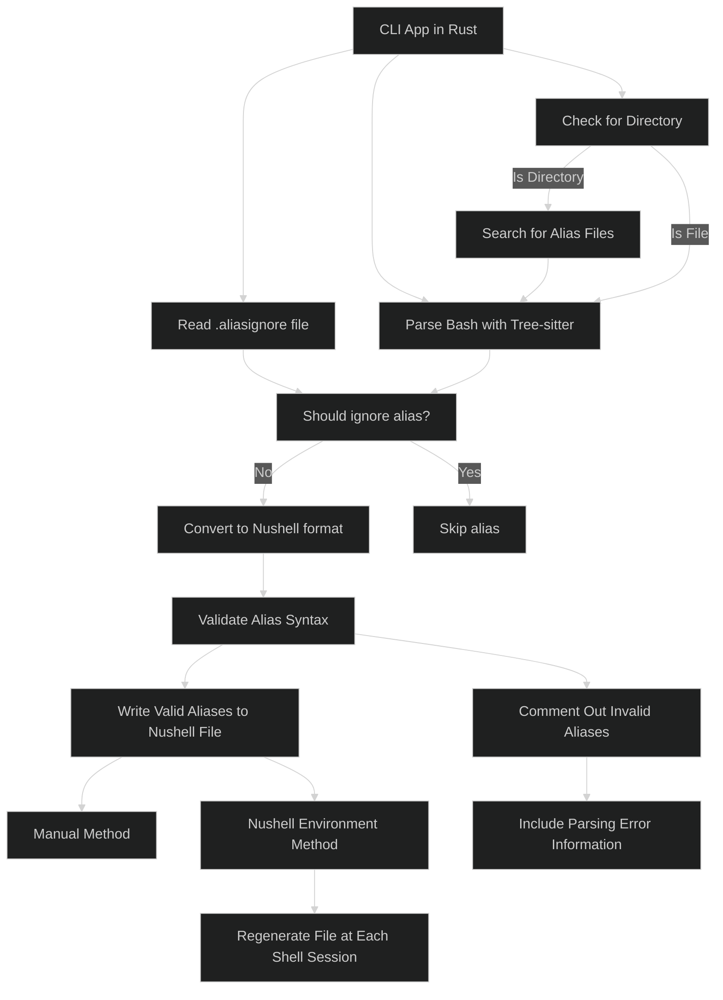

# Nushell alias converter

> [!NOTE]  
> This project is for educational purposes. I aim to learn more about
> tree-sitter, parsing, and Rust.

# Installation

```bash
cargo install nu-alias-converter
```

## Usage

The main purpose of this tool is to convert Bash aliases to Nushell aliases.  

This can be done with this simple command:

```bash
# will generate a bash-aliases.nu file in the same directory
nu-alias-converter .bash_aliases 
```

You can also pass directories as the file path. The tool will search for files
with names like `.bash_aliases`, `.aliases`, or `.bash_profile` in the specified
directory:

```bash
# will search for alias files in the specified directory
nu-alias-converter /path/to/directory 
```

For optimal use, integrate it into your Nushell environment. This approach offers two key advantages:

1. **Automatic regeneration:** The alias file is recreated at the start of each shell session.
2. **Continuous synchronization:** Your Nushell aliases stay up-to-date with your Bash aliases.

This ensures that any changes to your Bash aliases are immediately reflected in your Nushell environment.

Add this to the end of your `env.nu` file (find it by running `$nu.env-path` in Nushell):

```nushell
# This command will be shorter in the future, I promise
nu-alias-converter ~/.bash_aliases -o $"($nu.default-config-dir)/bash-alises.nu"  | ignore
````

Now add this to your `config.nu` to source the generated aliases file (find the path
with `nu.config-path`):

```nushell
source bash_aliases.nu
```

This will make the bash aliases available in the Nushell environment.

### Ignoring Aliases

Sometimes there are some aliases that you don't want to convert to Nushell,
maybe because they are not valid or you don't want to use them in Nushell.

You can ignore aliases by adding them to a `.aliasignore` file in the root of
your home directory or in the nushell config directory.

The file should contain all the aliases that should be ignored, one per line:

```plaintext
# ~/.aliasignore
ls
la
gst
```

This will not convert any of those aliases to nushell.

Another option is to ignore all the aliases that use a command, the syntax would
be the same but with a bang (`!`) in front of the command name:

```plaintext
# ~/.aliasignore
la
gst
!ls
!htop
```

This will also ignore all the aliases that use `ls` and `htop`.

## How?

The CLI app will be written in Rust, needs to be to use the nushell crates
used for parsing. It will use
[treesitter](https://github.com/tree-sitter/tree-sitter) to parse the bash
script and get all the aliases.

The aliases will then be converted to the nushell format using the
[nu-parser](https://github.com/nushell/nushell/tree/main/crates/nu-parser)
crate. After converting, the aliases will be validated, if an alias is not
valid it will be generated as a comment with the information of the parsing
error. So the user can check it and fix it manually. It would be nice to auto
generate the rust code from the content of the alias is the parsing fails but
this is not a priority for now.

The converted aliases are written to a file. You can either generate them
manually or use the Nushell environment. If using the environment method, the
file will regenerate at the start of each shell session.

**Unnecessary diagram:**  
Not that complex but I always wanted to try this out.


