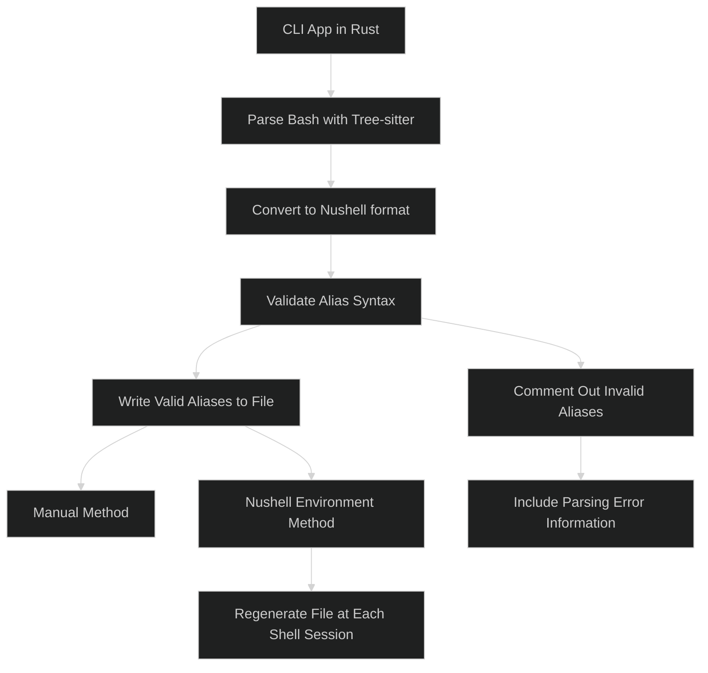

# Nu alias converter

> [!NOTE]  
> This project is for educational purposes. I aim to learn more about
> tree-sitter, parsing, and Rust.

## How?

The CLI app will be written in Rust, needs to be to use the nushell crates
used for parsing. It will use
[treesitter](https://github.com/tree-sitter/tree-sitter) to parse the bash
script and get all the aliases.

The aliases will then be converted to the nushell format using the
[nu-parser](https://github.com/nushell/nushell/tree/main/crates/nu-parser)
crate. After converting, the aliases will be validated, if an alias is not
valid it will be generated as a comment with the information of the parsing
error. So the user can check it and fix it manually. It would be nice to auto
generate the rust code from the content of the alias is the parsing fails but
this is not a priority for now.

The converted aliases are written to a file. You can either generate them
manually or use the Nushell environment. If using the environment method, the
file will regenerate at the start of each shell session.

**Unnecessary diagram:**  
Not that complex but I always wanted to try this out.



## Usage

Current implementation:

```bash
nu-alias-converter .bash_aliases # will generate a alias.nu file in the same directory
```

in the future it will work like this:

```bash
nu-alias-converter .bash_aliases --out /path/to/nushell/nushell_aliases.nu
```

**TODO:**

**Parsing Bash Aliases**

- [x] Use tree-sitter to parse Bash and get all aliases
- [ ] Handle `expand_aliases` and `shopt -s expand_aliases`
  - [ ] Implement recursive handling

**Conversion to Nushell Format**

- [x] Convert aliases to Nushell format
- [x] Validate alias content to ensure it is valid Nushell (with nu-parser)

**File Handling**

- [x] Write the converted aliases to a file
  - [x] Write once
  - [ ] Use Nushell environment variables
- [ ] Add a command to source the file in Nushell
  - [ ] Implement auto-source functionality (?)
- [ ] Handle multiple files in a directory
- [ ] Handle non-Bash script files
- [ ] Add `.alias_ignore` file to skip certain aliases during conversion
- [x] Handle cases when no aliases are found in the file
- [x] Handle empty files

**Flags and Modes**

- [x] Add `--help` flag
- [x] Add `--no-comments` flag
- [x] Handle `*.nu` files error
- [x] Handle missing files
- [x] Add debug mode

**Performance**

- [x] Use rayon to parallelize the conversion process
  - Improved from 25 seconds to 5 seconds with a 28888 line aliases file ✅
