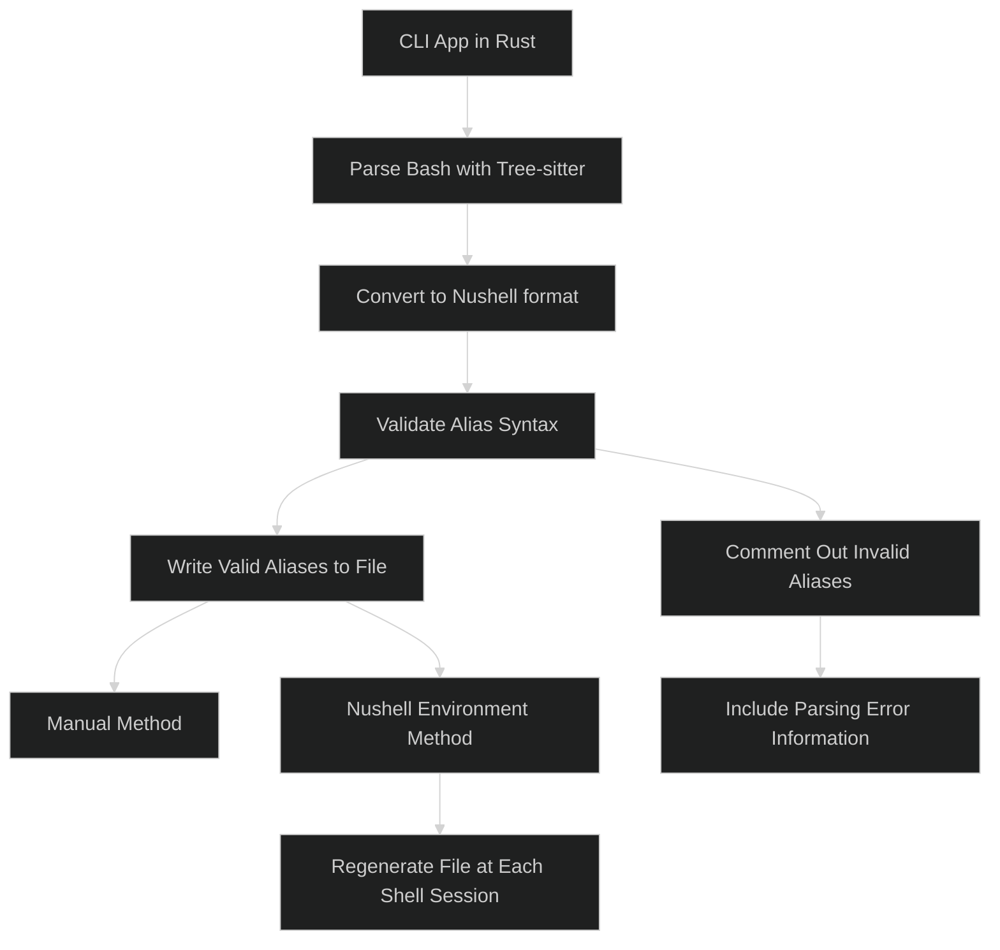

# Nu alias converter

> [!NOTE]  
> This project is for educational purposes. I aim to learn more about tree-sitter and Rust.

TODO:

- [ ] Bash aliases converter (bash to nushell)
  - [x] Use treesitter to parse bash and get all the aliases
    - [ ] Handle `expand_aliases` and `shopt -s expand_aliases`
      - [ ] Needs to be recursive
  - [x] Convert them to nushell format
    - [x] Validate the content of the alias to check if it is valid nushell
  - [x] Write them to a file
    - [x] Single time
    - [ ] Use nushell env
  - [ ] Add a command to source the file
  - [ ] Add debug flag
  - [ ] Handle empty files
  - [ ] Handle multiple files in a directory
  - [ ] Handle when no aliases are found in the file
  - [ ] Handle when the file is not a bash script
  - [x] Add help flag
  - [x] Add no comments flag
  - [x] Handle when file is `*.nu`
  - [x] Handle when the file does not exist
  - [ ] Add `.alias_ignore` file to ignore aliases on conversion

## How?

The CLI app will be written in Rust, needs to be to use the nushell crates
used for parsing. It will use
[treesitter](https://github.com/tree-sitter/tree-sitter) to parse the bash
script and get all the aliases.

The aliases will then be converted to the nushell format using the
[nu-parser](https://github.com/nushell/nushell/tree/main/crates/nu-parser)
crate. After converting, the aliases will be validated, if an alias is not
valid it will be generated as a comment with the information of the parsing
error. So the user can check it and fix it manually. It would be nice to auto
generate the rust code from the content of the alias is the parsing fails but
this is not a priority for now.

The converted aliases are written to a file. You can either generate them
manually or use the Nushell environment. If using the environment method, the
file will regenerate at the start of each shell session.

**Unnecessary diagram:**  
Not that complex but I always wanted to try this out.



## Usage

Current implementation:

```bash
nu-alias-converter .bash_aliases # will generate a alias.nu file in the same directory
```

in the future it will work like this:

```bash
nu-alias-converter .bash_aliases --out /path/to/nushell/nushell_aliases.nu
```
