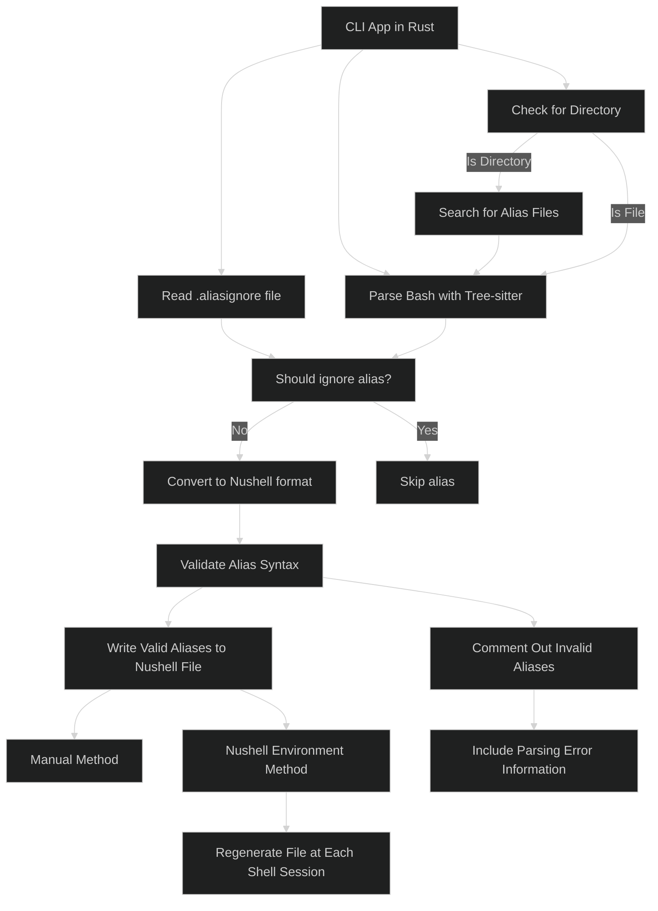

# Nushell alias converter

## Why?

Nushell doesn’t directly support bash aliases due to syntax differences, making
migration difficult since some aliases may break, and you can't source
`.bash_aliases` directly.

`nu-alias-converter` automates converting aliases from files or directories to
Nushell syntax for easy loading in your config. It validates aliases using
the `nu-parser` crate to prevent config issues.

If you prefer keeping all your aliases in a single file (e.g., `~/.bash_aliases`) for
cross-shell compatibility, this tool is perfect for you.

**Key features:**

- Converts bash aliases to Nushell syntax
- Comments out invalid aliases with explanations
- Ignores aliases based on user-defined criteria
- Syncs aliases at each shell session start
- Allows manual review of problematic aliases

This project was built to learn Rust and tree-sitter parsing, but it also helps
anyone who has accumulated aliases over the years to transition smoothly to
Nushell while retaining compatibility.

# Installation

```bash
cargo install nu-alias-converter
```

## Usage

Convert a single file to Nushell aliases:

```bash
# will generate a bash-aliases.nu file in the same directory
nu-alias-converter .bash_aliases
```

Convert all files with aliases in a directory:

```bash
# will search for alias files in the specified directory and generate
# a bash-aliases.nu file in the same directory
nu-alias-converter /path/to/directory
```

For optimal use, integrate it into your Nushell environment. This approach
offers two key advantages:

1. **Automatic regeneration:** The alias file is recreated at the start of each
   shell session.
2. **Continuous synchronization:** Your Nushell aliases stay up-to-date with
   your Bash aliases.

This ensures that any changes to your Bash aliases are immediately reflected in
your Nushell environment.

Add this to the end of your `env.nu` file (find it by running `$nu.env-path` in
Nushell):

```nushell
# This command will be shorter in the future
nu-alias-converter ~/.bash_aliases -o $"($nu.default-config-dir)/bash-aliases.nu" | ignore
```

Now add this to your `config.nu` to source the generated aliases file (find the
path with `nu.config-path`):

```nushell
source bash_aliases.nu
```

This will make the bash aliases available in the Nushell environment.

### Ignoring Aliases

Sometimes there are some aliases that you don't want to convert to Nushell,
maybe because they are not valid or you don't want to use them in Nushell.

You can ignore aliases by adding them to a `.aliasignore` file in the root of
your home directory or in the nushell config directory.

The file should contain all the aliases that should be ignored, one per line:

```gitignore
# ~/.aliasignore
ls
la
gst
```

This will not convert any of those aliases to nushell.

Another option is to ignore all the aliases that use a command, the syntax would
be the same but with a bang (`!`) in front of the command name:

```gitignore
# ~/.aliasignore
la
gst
!ls
!htop
```

This will also ignore all the aliases that use `ls` and `htop`.

## Shell support

| Shell  | Status                                                                | Aliases |
| ------ | --------------------------------------------------------------------- | ------- |
| `sh`   | <span style="font-weight: bold; color: #90EE90;">Supported</span>     | ✓       |
| `bash` | <span style="font-weight: bold; color: #90EE90;">Supported</span>     | ✓       |
| `zsh`  | <span style="font-weight: bold; color: #ADD8E6;">Not tested</span>    | ~       |
| `fish` | <span style="font-weight: bold; color: #FFCCCB;">Not supported</span> | ✗       |

- ✓ : Fully supported
- ~ : Should work but some limitations may apply
- ✗ : Not supported

## How?

The CLI app will be written in Rust, needs to be to use the nushell crates
used for parsing. It will use
[treesitter](https://github.com/tree-sitter/tree-sitter) to parse the bash
script and get all the aliases.

The aliases will then be converted to the nushell format using the
[nu-parser](https://github.com/nushell/nushell/tree/main/crates/nu-parser)
crate. After converting, the aliases will be validated, if an alias is not
valid it will be generated as a comment with the information of the parsing
error. So the user can check it and fix it manually. It would be nice to auto
generate the rust code from the content of the alias is the parsing fails but
this is not a priority for now.

The converted aliases are written to a file. You can either generate them
manually or use the Nushell environment. If using the environment method, the
file will regenerate at the start of each shell session.

**Unnecessary diagram:**  
Not that complex but I always wanted to try this out.


